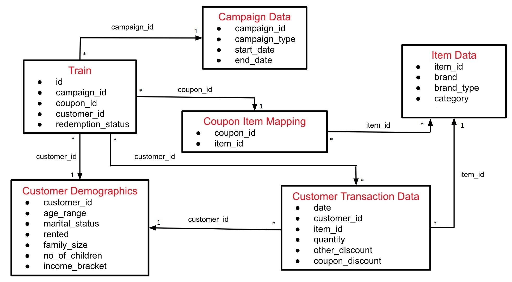

# AmExpert 2019 Machine Learning Hackathon

## Problem Statement
XYZ Credit Card company regularly helps it’s merchants understand their data better and take key business decisions accurately by providing machine learning and analytics consulting. ABC is an established Brick & Mortar retailer that frequently conducts marketing campaigns for its diverse product range. As a merchant of XYZ, they have sought XYZ to assist them in their discount marketing process using the power of machine learning. ABC would like the ability to predict whether customers redeem the coupons received across channels, and the important attributes that have an impact on coupon redemption. Through having this ability, it would enable the retailer’s marketing team to accurately design coupon construct, and develop targeted marketing strategies accordingly. 

## Data Schema
The data available in this problem contains total six files which are “campaign_data”, “item_data, “coupon_item_mapping”,  “customer_demographics”, “customer_transaction_data”, and “train” in the dataset. The relationship between each files are as below:

## Data Preprocessing
### Merging data
The dataset contains multiple tables and hence proper merging of each table need to be performed depending upon the type of relationship.

**one-to-many relationship tables**
|Relationship|Tables|Key|Merging Techniques|
| -----------| -----| --|------------------|
|One to Many |Campaign_data and train|Campaign id|Left Join by primary key|
|One to Many |Customer_demographics and train|Customer id|Left Join by primary key|
|One to Many |Item_data and customer_transaction_data|item_id|Left Join by primary key|
|One to Many |Customer_demographics and customer_transaction_data|Customer id|Left Join by primary key|

**many-to-many relationship tables**
|Relationship|Tables|Key|Merging Techniques|
| -----------| -----| --|------------------|
|Many to Many |Train and customer_transaction_data|Customer_id|Aggregation of columns |
|Many to Many |Coupon_Item_Mapping and Item_data|Item id|Aggregation of columns |
|Many to Many |Coupon_Item_Mapping  and Customer_transaction_data|item_id|Aggregation of columns|

### Data Clean
- Highly imbalanced data (99.07%:0.93%) i.e 99.07% of coupons were not redeemed, and only 0.93% coupons were redeemed. Therefore, I used two techniques SMOTE and ROSE to balance data.
- Missing data: half of values missing in customer_demographics. Therefore, this table is not useful and can be removed from the dataset.
- feature creation: since I droped the customer_demographics table, I merged coupon_item_mapping table and customer_transaction_table, then created some features realted to customer such as Number of categories purchased by the customer, Historical average selling price purchased by customer. 
- correlation analysis: drop vairalbes that have high correlation, threshold is 0.8.
- Near zero variance analysis: drop variables have one unique value or few unique values across observations
- Descriptive statistics of each variable: Since highly skewed data has an impact on models; therefore, I used Box Cox transformation to normalize the skewed variables

### Model Planning and Model Building 
- Divide dataset into train and test : split the rows whose campaign_id are smaller than 14 into train data and rows whose campaign id are larger than 14 into test data. The ratio of observations between training data and test data is around 8:2
- Models:   Since I used SMOTE and ROSE method to balance the training data, I trained different machine learning algorithms on both SMOTE and ROSE methods, including: Logistic regression, Decision tree，Support vector machine，Random Forest, XGboost.
- Evaluation Metric: ROC curve between the predicted probability and the observed target, balanced accuracy
   
### Result
- Logistic regression and XGboost perform best, and test result achieved almost 93% balanced accuracy.
- The five most important variables that have impact on coupon redemption:
  Redemption_chance, No_brand_type_purchased_CouponRedeem, No_category_purchased_CouponRedeem, Duration, Past_avg_custom_quant

